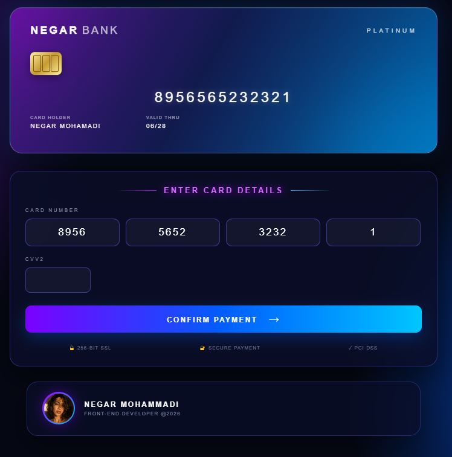

# 💳 Neon Bank Card UI

A modern **Bank Card UI** built with **HTML, CSS and Vanilla
JavaScript**.

The project includes a live card preview, segmented card-number inputs,
automatic focus movement, CVV2 input and a responsive layout.

## 📸 Preview



## 🚀 Demo

https://negarlmd.github.io/Card-Bank/

> For a public online demo, deploy the project with GitHub Pages and
> replace this link with your Pages URL.

## ✨ Features

-   💳 Modern neon / glassmorphism bank card design
-   ⌨️ Four separate inputs for the card number
-   ⚡ Automatic focus to the next card-number input
-   🔐 Automatic focus on CVV2 after entering the fourth block
-   ✂️ Card-number blocks limited to 4 characters
-   🔄 Live card-number preview
-   📱 Responsive mobile layout
-   ✨ Hover and glow effects
-   🔒 Security information section
-   👤 Profile footer with contact links
-   💙 LinkedIn profile link

## 🛠️ Built With

-   HTML5
-   CSS3
-   Vanilla JavaScript
-   CSS Gradients
-   CSS Backdrop Filter
-   Responsive Media Queries

## 📁 Project Structure

``` text
bank-card/
├── index.html
├── script.js
├── src/
│   └── master.css
└── assets/
    ├── avatar.svg
    └── bank-card-preview.png
```

## 🧠 JavaScript

The card number is split into four inputs. When an input reaches four
characters, focus automatically moves to the next input. After the
fourth block, the CVV2 field receives focus.

The entered card number is also displayed live on the virtual card.

## 👩‍💻 Author

**Negar Mohammadi**\
Front-End Developer

-   LinkedIn: [negar-webdev](https://www.linkedin.com/in/negar-webdev/)

------------------------------------------------------------------------

⭐ If you like this UI, feel free to use it as a starting point for your
own front-end projects.
